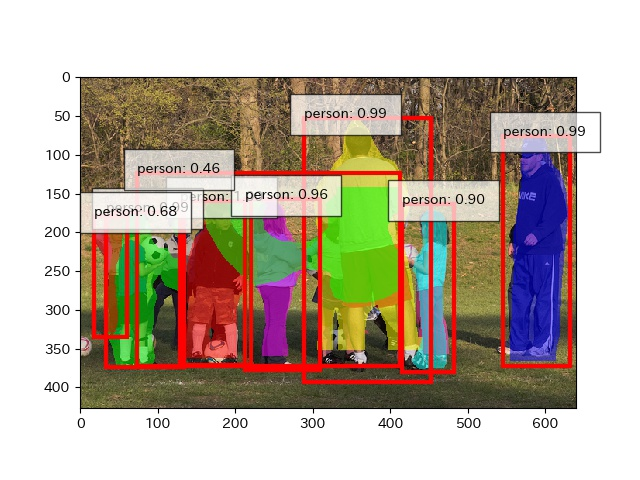
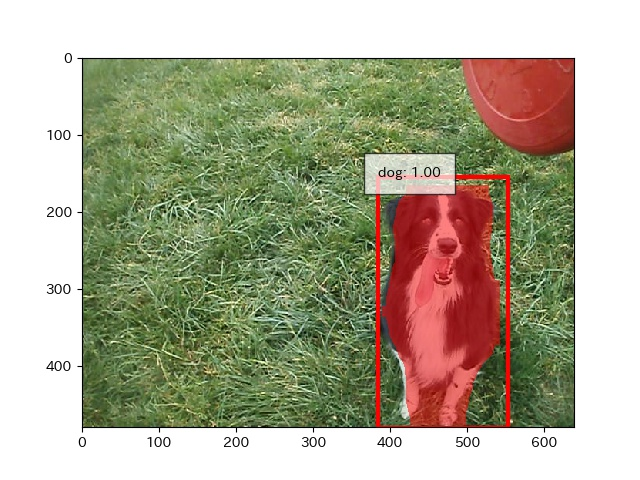
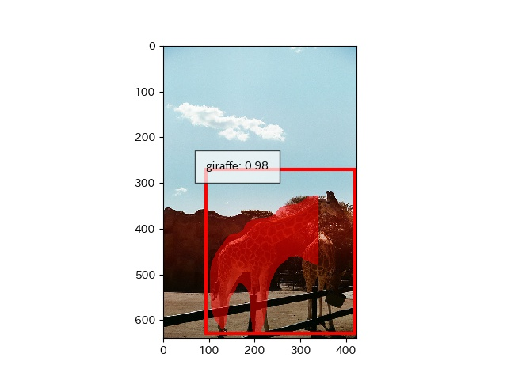

# chainer-maskrcnn

original paper http://arxiv.org/abs/1703.06870

# 現状





# todo、問題点など

- 論文の中で言うC4 backbone(Resnet50ベース)しか実装していません
- ROI Alignを実装していません
- RPNが出力したROIに対してMask推定をするのと並行して、ROIの位置修正（回帰）を行っているので、出力したMaskと最終的なBounding Boxが一致していません（ex.キリンのマスクが右の方でバッサリ切れている)
- 学習を進めるとどんどんメモリ使用量が増えていく問題があるので、現在調査中です。
メモリ64GBのp2.xlargeインスタンスで学習したところ、データを1周したあとで増加は止まったので、そうゆう挙動で正しいのかもしれません。
ただ、メモリ16GBのマシンだと動かないのは個人的に困っているので、調査を続けます。

# 準備

python=3.6

```
pip install chainer chainercv chainerui cupy cython
pip install -e 'git+https://github.com/pdollar/coco.git#egg=pycocotools&subdirectory=PythonAPI'
```
2行目については https://github.com/cocodataset/cocoapi/issues/53#issuecomment-306667323


MSCOCOをダウンロードしてdata以下に展開
- train2014.zip
- val2014.zip
- annotations_trainval2014.zip

# acknowledgement

[chainercvを用いたMask R-CNNの実装](https://engineer.dena.jp/2017/12/chainercvmask-r-cnn.html)

MaskRCNNResnet50.py, ProposalTargetCreator.pyの実装で思いっきり参考にさせていただいています。
