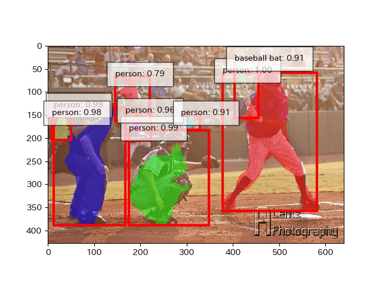
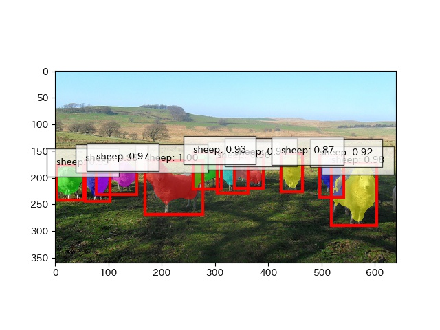
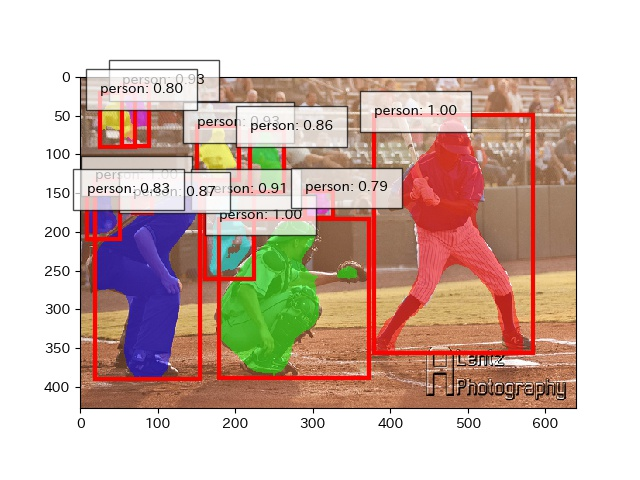
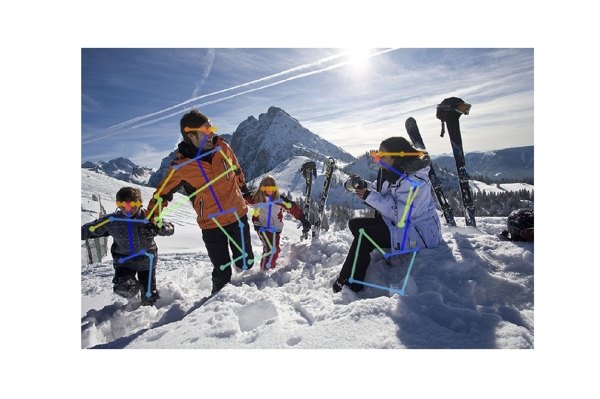

# chainer-maskrcnn

## original paper
Mask R-CNN http://arxiv.org/abs/1703.06870

Light-Head R-CNN: http://arxiv.org/abs/1711.07264

# current status

## using LightHead architecture

Good examples :)




many results are available here.
https://drive.google.com/drive/u/1/folders/1BwYDFdGpaRNWTU2HyV18VuDvwqndv0e_

## Feature Pyramid network

mask accuracy looks better than above.



## keypoint

!! I just trained 20000 iter, so result is bad.



# todo, issues

- 学習を進めるとどんどんメモリ使用量が増えていく問題があるので、現在調査中です。
メモリ64GBのp2.xlargeインスタンスで学習したところ、データを1周したあとで増加は止まったので、そうゆう挙動で正しいのかもしれません。
ただ、メモリ16GBのマシンだと動かないのは個人的に困っているので、調査を続けます。
- add prediction notebook
- use COCO 2017
- currently, only FPN backbone will work(I have backward compatibility broke down)

# setup

python=3.6

```
pip install chainer chainercv chainerui cupy cython
pip install -e 'git+https://github.com/pdollar/coco.git#egg=pycocotools&subdirectory=PythonAPI'
```
2行目については https://github.com/cocodataset/cocoapi/issues/53#issuecomment-306667323


MSCOCOをダウンロードしてdata以下に展開
- train2014.zip
- val2014.zip
- annotations_trainval2014.zip

# pretrained model

| architecture | url |
|:-----------|:------------:|
| light head | https://drive.google.com/file/d/10tBJpWkimyr5r_DZ8wXsKPsb7-zm_7BT/view?usp=sharing |


# acknowledgement

[chainercvを用いたMask R-CNNの実装](https://engineer.dena.jp/2017/12/chainercvmask-r-cnn.html)

MaskRCNNResnet50, ProposalTargetCreatorの実装で思いっきり参考にさせていただいています。
